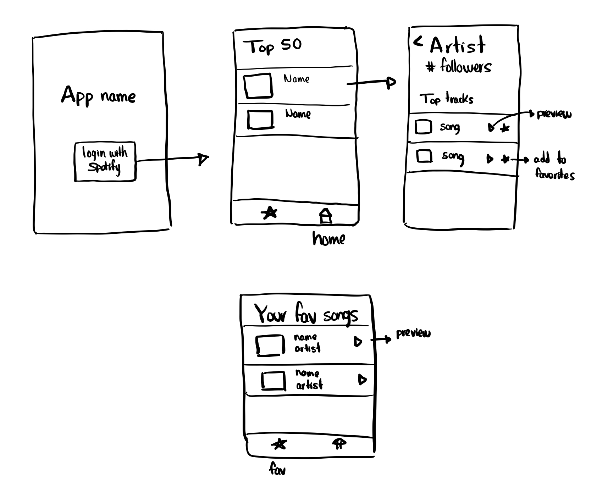

# MicroMuse
Make School | MOB 2.3 | Final Project for MOB 2.3

> A project that allows users to look at the top artists of their Spotify account and preview their songs. Allows the user to then save the songs they like (Within the app).
 - **Note!** You will need the Spotify App installed in order to use the login feature for this application

## Technologies
 - CoreData
 - Swift
 - Xcode
 - Spotify SDK
 
 ## Given Wireframes
 
 
 ### How it Works
 Using the app is a matter of installing it on your phone, along with the Spotify App
 
 Once open, you login and authenticate using your Spotify account via the Spotify app
 It will open up then to the users top artists. From there:
 - You can go to artists top songs and listen to previews for them (Should a preview be available)
 - Favorite songs you like, and then view and play those specifically in th favorites window
 - You can logout (Currently in the works, strange error occuring)
